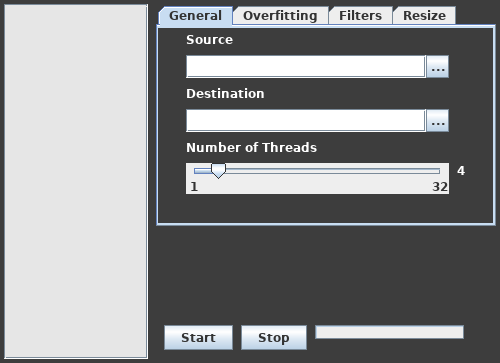

# Mirror - Image Dataset Generator with a GUI

### What is mirror?
Mirror is an application that allows you to easily generate images for a dataset given some source material by running the executable .jar file.

### Features
* Supports converting video files into images and then processing them.
    * Avi, webm, mp4 and mov are supported. 
* Supports converting gif files into images.
* Supports png/jpg images.
* Resizes images with either cropping or by changing aspect ratio.
* Supports counter measures to prevent overfitting when training neural networks. With horizontal and vertical jitter, as well as horizontal and vertical flipping.
* Easy importing and exporting of images
* Multithreading support (UP to 32 CPU threads)

* GUI Interface!

